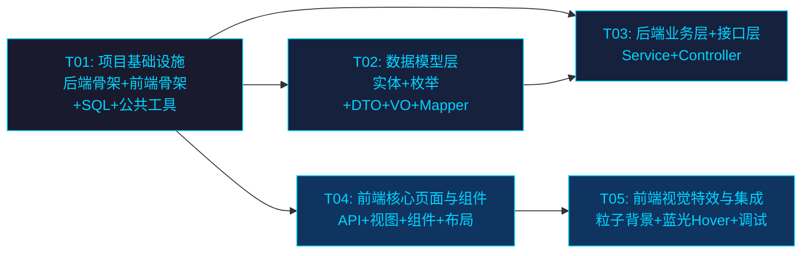

# 系统设计文档：龙族守夜人讨论区（dragon_raja_forum）

> 架构师：高见远（Bob）  
> 版本：v1.0  
> 日期：2026-07-10

---

## 目录

- [Part A：系统设计](#part-a系统设计)
  - [1. 实现方案与框架选型](#1-实现方案与框架选型)
  - [2. 完整文件列表](#2-完整文件列表)
  - [3. 数据结构与接口（类图）](#3-数据结构与接口类图)
  - [4. 程序调用流程（时序图）](#4-程序调用流程时序图)
  - [5. 待明确事项](#5-待明确事项)
- [Part B：任务分解](#part-b任务分解)
  - [6. 依赖包列表](#6-依赖包列表)
  - [7. 任务列表](#7-任务列表)
  - [8. 共享知识（跨文件约定）](#8-共享知识跨文件约定)
  - [9. 任务依赖图](#9-任务依赖图)

---

# Part A：系统设计

## 1. 实现方案与框架选型

### 1.1 后端整体架构

采用经典 **三层架构**（Controller → Service → Mapper），结合 SpringBoot 3 自动配置，实现高内聚低耦合。

```
┌──────────────────────────────────────────────────┐
│                   前端 (Vue3 SPA)                  │
│         Axios → /api/*  (JSON over HTTP)          │
└──────────────────┬───────────────────────────────┘
                   │ HTTP + JWT
┌──────────────────▼───────────────────────────────┐
│              Controller 层 (REST API)              │
│  AuthController / UserController / PostController │
│  CommentController / AnnouncementController       │
│  AdminController                                  │
├──────────────────────────────────────────────────┤
│     JWT过滤器 → 参数校验 → 调用Service → 统一返回    │
├──────────────────────────────────────────────────┤
│              Service 层 (业务逻辑)                  │
│  UserService / PostService / CommentService       │
│  AnnouncementService                              │
├──────────────────────────────────────────────────┤
│              Mapper 层 (MyBatis-Plus)              │
│  UserMapper / PostMapper / CommentMapper           │
│  AnnouncementMapper                               │
├──────────────────────────────────────────────────┤
│              MySQL 8 (utf8mb4)                     │
│  user / post / comment / announcement             │
└──────────────────────────────────────────────────┘
```

**核心机制说明：**

| 机制 | 实现方式 |
|------|---------|
| **JWT 鉴权** | 登录成功签发 JWT Token（含 userId、username、role），前端存 localStorage，每次请求 Axios 拦截器自动添加 `Authorization: Bearer <token>` 请求头；后端 `JwtAuthenticationFilter` 统一拦截校验 |
| **CORS 配置** | `CorsConfig` 全局配置允许前端域名跨域，允许所有请求头和方法，预检请求有效期 3600s |
| **统一返回** | `Result<T>` 包装所有响应，格式 `{code, message, data}`；分页返回 `PageResult<T>` 含 `{records, total, current, size}` |
| **异常处理** | `@RestControllerAdvice` 全局异常处理器，业务异常 `BusinessException` + 系统异常统一捕获 |
| **密码加密** | Spring Security 的 `BCryptPasswordEncoder`（不引入完整 Spring Security，仅用其加密工具类） |
| **分页** | MyBatis-Plus `Page` 对象 + `PaginationInnerInterceptor` 分页插件 |

### 1.2 前端整体架构

采用 **Vue3 Composition API + Vite 构建**，结构清晰：

```
┌─────────────────────────────────────────────┐
│              Vue Router (路由守卫)             │
│   /login  /register  /  /post/:id  /profile  │
│   /admin/*  (需管理员权限)                      │
├─────────────────────────────────────────────┤
│              Pinia (状态管理)                  │
│   userStore: token / userInfo / 登录登出       │
├─────────────────────────────────────────────┤
│              Axios 封装 (request.js)           │
│   请求拦截器: 添加Token                        │
│   响应拦截器: 统一处理 code / 401跳转登录       │
├─────────────────────────────────────────────┤
│              API 模块                          │
│   auth / user / post / comment / announcement │
│   / admin                                     │
├─────────────────────────────────────────────┤
│              Views + Components               │
│   页面视图 + 可复用组件 + 布局组件              │
├─────────────────────────────────────────────┤
│              ElementPlus + 自定义深色主题       │
│   全局蓝光Hover特效 / 粒子背景                 │
└─────────────────────────────────────────────┘
```

**前端路由设计：**

| 路径 | 组件 | 鉴权 | 说明 |
|------|------|------|------|
| `/login` | LoginView | 无 | 登录页（粒子背景） |
| `/register` | RegisterView | 无 | 注册页 |
| `/` | HomeView | 无 | 首页（公告+帖子列表+在线用户） |
| `/post/:id` | PostDetailView | 无 | 帖子详情+评论 |
| `/post/create` | PostCreateView | 需登录 | 发布帖子 |
| `/profile` | ProfileView | 需登录 | 个人资料 |
| `/admin` | AdminLayout | 需管理员 | 管理后台布局 |
| `/admin/users` | UserManageView | 需管理员 | 用户管理 |
| `/admin/posts` | PostManageView | 需管理员 | 帖子管理 |
| `/admin/announcements` | AnnouncementManageView | 需管理员 | 公告管理 |

### 1.3 技术选型理由

| 技术 | 版本 | 选型理由 |
|------|------|---------|
| **Java** | 17 | LTS 版本，SpringBoot 3 最低要求，提供 record、sealed class 等现代语法 |
| **SpringBoot** | 3.2.x | 主流 Java Web 框架，自动配置简化开发，生态成熟 |
| **MyBatis-Plus** | 3.5.x | 在 MyBatis 基础上提供 CRUD 通用 Mapper、分页插件、代码生成，大幅减少样板代码 |
| **MySQL** | 8.x | 成熟关系型数据库，支持 JSON 函数、窗口函数，utf8mb4 支持完整 Unicode |
| **JWT (jjwt)** | 0.12.x | 无状态认证，适合前后端分离架构，无需 Session 存储 |
| **Lombok** | 1.18.x | 消除 getter/setter/构造器样板代码，提升开发效率 |
| **Vue3** | 3.4.x | Composition API 更好的逻辑复用，`<script setup>` 语法简洁，性能优于 Vue2 |
| **Vite** | 5.x | 极速冷启动 + HMR 热更新，开发体验远优于 Webpack |
| **ElementPlus** | 2.x | Vue3 生态最成熟的 UI 组件库，提供 Table/Form/Dialog/Pagination 等全套组件 |
| **Pinia** | 2.x | Vue3 官方推荐状态管理，TypeScript 友好，API 比 Vuex 更简洁 |
| **Axios** | 1.x | 主流 HTTP 客户端，拦截器机制便于统一处理 Token 和错误 |

---

## 2. 完整文件列表

### 2.1 后端文件（dragon-raja-server）

```
dragon-raja-server/
├── pom.xml                                                    # Maven 依赖配置
├── sql/
│   └── init.sql                                               # 数据库初始化脚本（建表+默认数据）
└── src/main/
    ├── java/com/dragonraja/forum/
    │   ├── ForumApplication.java                              # SpringBoot 启动类
    │   │
    │   ├── config/
    │   │   ├── CorsConfig.java                                # CORS 跨域配置
    │   │   ├── MybatisPlusConfig.java                         # MyBatis-Plus 分页插件配置
    │   │   └── WebMvcConfig.java                              # Web MVC 配置（注册拦截器）
    │   │
    │   ├── common/
    │   │   ├── Result.java                                    # 统一返回结果封装
    │   │   ├── ResultCode.java                                # 返回码枚举
    │   │   └── PageResult.java                                # 分页结果封装
    │   │
    │   ├── exception/
    │   │   ├── BusinessException.java                         # 业务异常
    │   │   └── GlobalExceptionHandler.java                    # 全局异常处理器
    │   │
    │   ├── security/
    │   │   ├── JwtUtils.java                                  # JWT 工具类（生成/解析/校验）
    │   │   ├── JwtAuthenticationFilter.java                   # JWT 认证过滤器
    │   │   └── UserContext.java                               # 线程上下文（当前登录用户）
    │   │
    │   ├── enums/
    │   │   ├── UserStatus.java                                # 用户状态枚举
    │   │   ├── PostCategory.java                              # 帖子分类枚举
    │   │   └── OnlineStatus.java                              # 在线状态枚举
    │   │
    │   ├── entity/
    │   │   ├── User.java                                      # 用户实体
    │   │   ├── Post.java                                      # 帖子实体
    │   │   ├── Comment.java                                   # 评论实体
    │   │   └── Announcement.java                              # 公告实体
    │   │
    │   ├── mapper/
    │   │   ├── UserMapper.java                                # 用户 Mapper
    │   │   ├── PostMapper.java                                # 帖子 Mapper
    │   │   ├── CommentMapper.java                             # 评论 Mapper
    │   │   └── AnnouncementMapper.java                        # 公告 Mapper
    │   │
    │   ├── service/
    │   │   ├── UserService.java                               # 用户服务接口
    │   │   ├── PostService.java                               # 帖子服务接口
    │   │   ├── CommentService.java                            # 评论服务接口
    │   │   └── AnnouncementService.java                       # 公告服务接口
    │   │
    │   ├── service/impl/
    │   │   ├── UserServiceImpl.java                           # 用户服务实现
    │   │   ├── PostServiceImpl.java                           # 帖子服务实现
    │   │   ├── CommentServiceImpl.java                        # 评论服务实现
    │   │   └── AnnouncementServiceImpl.java                   # 公告服务实现
    │   │
    │   ├── controller/
    │   │   ├── AuthController.java                            # 认证控制器（登录/注册）
    │   │   ├── UserController.java                            # 用户控制器（个人资料/在线用户）
    │   │   ├── PostController.java                            # 帖子控制器
    │   │   ├── CommentController.java                         # 评论控制器
    │   │   ├── AnnouncementController.java                    # 公告控制器
    │   │   └── AdminController.java                           # 管理后台控制器
    │   │
    │   ├── dto/
    │   │   ├── LoginDTO.java                                  # 登录请求 DTO
    │   │   ├── RegisterDTO.java                               # 注册请求 DTO
    │   │   ├── PostDTO.java                                   # 发布/编辑帖子 DTO
    │   │   ├── CommentDTO.java                                # 发表评论 DTO
    │   │   ├── AnnouncementDTO.java                           # 发布/编辑公告 DTO
    │   │   ├── UpdateProfileDTO.java                          # 更新个人资料 DTO
    │   │   └── AuditUserDTO.java                              # 用户审核 DTO
    │   │
    │   └── vo/
    │       ├── LoginVO.java                                   # 登录返回 VO（含 token）
    │       ├── UserVO.java                                    # 用户信息 VO
    │       ├── PostVO.java                                    # 帖子详情 VO
    │       ├── PostListVO.java                                # 帖子列表项 VO
    │       ├── CommentVO.java                                 # 评论 VO
    │       └── AnnouncementVO.java                            # 公告 VO
    │
    └── resources/
        ├── application.yml                                    # 应用配置
        └── mapper/
            ├── UserMapper.xml                                 # 用户 Mapper XML
            ├── PostMapper.xml                                 # 帖子 Mapper XML
            ├── CommentMapper.xml                              # 评论 Mapper XML
            └── AnnouncementMapper.xml                         # 公告 Mapper XML
```

### 2.2 前端文件（dragon-raja-frontend）

```
dragon-raja-frontend/
├── package.json                                               # npm 依赖配置
├── vite.config.js                                             # Vite 构建配置
├── index.html                                                 # HTML 入口
├── .env                                                       # 环境变量
└── src/
    ├── main.js                                                # 应用入口
    ├── App.vue                                                # 根组件
    │
    ├── router/
    │   └── index.js                                           # 路由配置 + 路由守卫
    │
    ├── stores/
    │   └── user.js                                            # 用户状态管理（Pinia）
    │
    ├── api/
    │   ├── request.js                                         # Axios 实例封装（拦截器）
    │   ├── auth.js                                            # 认证 API
    │   ├── user.js                                            # 用户 API
    │   ├── post.js                                            # 帖子 API
    │   ├── comment.js                                         # 评论 API
    │   ├── announcement.js                                    # 公告 API
    │   └── admin.js                                           # 管理后台 API
    │
    ├── layouts/
    │   └── MainLayout.vue                                     # 主布局（导航栏+内容区+页脚）
    │
    ├── views/
    │   ├── LoginView.vue                                      # 登录页（粒子背景）
    │   ├── RegisterView.vue                                   # 注册页
    │   ├── HomeView.vue                                       # 首页
    │   ├── PostDetailView.vue                                 # 帖子详情页
    │   ├── PostCreateView.vue                                 # 发布帖子页
    │   ├── ProfileView.vue                                    # 个人资料页
    │   └── admin/
    │       ├── AdminLayout.vue                                # 管理后台布局
    │       ├── UserManageView.vue                             # 用户管理
    │       ├── PostManageView.vue                             # 帖子管理
    │       └── AnnouncementManageView.vue                     # 公告管理
    │
    ├── components/
    │   ├── ParticleBackground.vue                             # 粒子动态背景
    │   ├── PostCard.vue                                       # 帖子卡片
    │   ├── CommentSection.vue                                 # 评论区组件
    │   ├── OnlineUsers.vue                                    # 在线用户栏
    │   ├── AnnouncementBanner.vue                             # 公告横幅
    │   └── Pagination.vue                                     # 分页组件
    │
    ├── styles/
    │   ├── variables.css                                      # CSS 变量（深色主题色值）
    │   └── global.css                                         # 全局样式（蓝光Hover等）
    │
    └── utils/
        └── format.js                                          # 工具函数（日期格式化等）
```

---

## 3. 数据结构与接口（类图）

### 3.1 完整 MySQL 建表语句

```sql
-- ============================================
-- 龙族守夜人讨论区 - 数据库初始化脚本
-- 数据库：dragon_raja_forum
-- 字符集：utf8mb4
-- ============================================

CREATE DATABASE IF NOT EXISTS `dragon_raja_forum`
  DEFAULT CHARACTER SET utf8mb4
  DEFAULT COLLATE utf8mb4_general_ci;

USE `dragon_raja_forum`;

-- ----------------------------
-- 1. 用户表
-- ----------------------------
DROP TABLE IF EXISTS `user`;
CREATE TABLE `user` (
  `id`             BIGINT       NOT NULL AUTO_INCREMENT  COMMENT '用户ID',
  `username`       VARCHAR(50)  NOT NULL                 COMMENT '用户名（登录账号）',
  `password`       VARCHAR(100) NOT NULL                 COMMENT '密码（BCrypt加密）',
  `nickname`       VARCHAR(50)  DEFAULT NULL             COMMENT '昵称',
  `avatar`         VARCHAR(255) DEFAULT NULL             COMMENT '头像URL',
  `bloodline_grade` CHAR(1)     NOT NULL DEFAULT 'D'     COMMENT '血统等级：D/C/B/A/S',
  `faction`        VARCHAR(20)  DEFAULT NULL             COMMENT '派系：狮心会/学生会/执行部/教授',
  `status`         TINYINT      NOT NULL DEFAULT 0       COMMENT '状态：0-待审核 1-正常 2-封禁',
  `online_status`  TINYINT      NOT NULL DEFAULT 0       COMMENT '在线状态：0-离线 1-在线',
  `role`           VARCHAR(20)  NOT NULL DEFAULT 'USER'  COMMENT '角色：USER-普通用户 ADMIN-管理员',
  `signature`      VARCHAR(200) DEFAULT NULL             COMMENT '个性签名',
  `create_time`    DATETIME     NOT NULL DEFAULT CURRENT_TIMESTAMP                  COMMENT '创建时间',
  `update_time`    DATETIME     NOT NULL DEFAULT CURRENT_TIMESTAMP ON UPDATE CURRENT_TIMESTAMP COMMENT '更新时间',
  PRIMARY KEY (`id`),
  UNIQUE KEY `uk_username` (`username`)
) ENGINE=InnoDB DEFAULT CHARSET=utf8mb4 COMMENT='用户表';

-- ----------------------------
-- 2. 帖子表
-- ----------------------------
DROP TABLE IF EXISTS `post`;
CREATE TABLE `post` (
  `id`           BIGINT        NOT NULL AUTO_INCREMENT  COMMENT '帖子ID',
  `title`        VARCHAR(200)  NOT NULL                 COMMENT '标题',
  `content`      TEXT          NOT NULL                 COMMENT '正文内容',
  `category`     TINYINT       NOT NULL DEFAULT 1       COMMENT '分类：1-闲聊 2-史料 3-委托 4-交换',
  `user_id`      BIGINT        NOT NULL                 COMMENT '发布者用户ID',
  `view_count`   INT           NOT NULL DEFAULT 0       COMMENT '浏览量',
  `comment_count` INT          NOT NULL DEFAULT 0       COMMENT '评论数',
  `is_top`       TINYINT       NOT NULL DEFAULT 0       COMMENT '是否置顶：0-否 1-是',
  `create_time`  DATETIME      NOT NULL DEFAULT CURRENT_TIMESTAMP                  COMMENT '创建时间',
  `update_time`  DATETIME      NOT NULL DEFAULT CURRENT_TIMESTAMP ON UPDATE CURRENT_TIMESTAMP COMMENT '更新时间',
  PRIMARY KEY (`id`),
  KEY `idx_user_id` (`user_id`),
  KEY `idx_category` (`category`),
  KEY `idx_is_top` (`is_top`),
  KEY `idx_create_time` (`create_time`)
) ENGINE=InnoDB DEFAULT CHARSET=utf8mb4 COMMENT='帖子表';

-- ----------------------------
-- 3. 评论表
-- ----------------------------
DROP TABLE IF EXISTS `comment`;
CREATE TABLE `comment` (
  `id`           BIGINT        NOT NULL AUTO_INCREMENT  COMMENT '评论ID',
  `post_id`      BIGINT        NOT NULL                 COMMENT '所属帖子ID',
  `user_id`      BIGINT        NOT NULL                 COMMENT '评论者用户ID',
  `content`      VARCHAR(1000) NOT NULL                 COMMENT '评论内容',
  `create_time`  DATETIME      NOT NULL DEFAULT CURRENT_TIMESTAMP COMMENT '创建时间',
  PRIMARY KEY (`id`),
  KEY `idx_post_id` (`post_id`),
  KEY `idx_user_id` (`user_id`)
) ENGINE=InnoDB DEFAULT CHARSET=utf8mb4 COMMENT='评论表';

-- ----------------------------
-- 4. 公告表
-- ----------------------------
DROP TABLE IF EXISTS `announcement`;
CREATE TABLE `announcement` (
  `id`           BIGINT        NOT NULL AUTO_INCREMENT  COMMENT '公告ID',
  `title`        VARCHAR(200)  NOT NULL                 COMMENT '公告标题',
  `content`      TEXT          NOT NULL                 COMMENT '公告内容',
  `is_top`       TINYINT       NOT NULL DEFAULT 1       COMMENT '是否置顶：0-否 1-是',
  `user_id`      BIGINT        NOT NULL                 COMMENT '发布者用户ID（管理员）',
  `create_time`  DATETIME      NOT NULL DEFAULT CURRENT_TIMESTAMP COMMENT '创建时间',
  `update_time`  DATETIME      NOT NULL DEFAULT CURRENT_TIMESTAMP ON UPDATE CURRENT_TIMESTAMP COMMENT '更新时间',
  PRIMARY KEY (`id`)
) ENGINE=InnoDB DEFAULT CHARSET=utf8mb4 COMMENT='公告表';

-- ----------------------------
-- 默认数据：管理员账号 norma / 123456
-- 密码 123456 的 BCrypt 加密值
-- ----------------------------
INSERT INTO `user` (`username`, `password`, `nickname`, `bloodline_grade`, `faction`, `status`, `online_status`, `role`, `signature`)
VALUES ('norma', '$2a$10$N.ZOn9G6/YLFixAOPMg/h.z7pCu6v2XyFDtC4q.jeeGm/TEZyj3C6', '守夜人· norma', 'S', '教授', 1, 0, 'ADMIN', '卡塞尔学院守夜人，永恒守望');

-- 默认公告
INSERT INTO `announcement` (`title`, `content`, `is_top`, `user_id`)
VALUES ('欢迎来到守夜人讨论区', '各位学员，欢迎来到卡塞尔学院守夜人讨论区。请遵守学院规章，文明讨论。血统等级达到B级以上方可接取委托任务。', 1, 1);
```

### 3.2 后端 API 接口设计

| 接口 | 方法 | 路径 | 描述 | 是否需要鉴权 |
|------|------|------|------|:---:|
| 用户注册 | POST | `/api/auth/register` | 注册新用户（待审核状态） | ❌ |
| 用户登录 | POST | `/api/auth/login` | 登录并返回 JWT Token | ❌ |
| 获取当前用户信息 | GET | `/api/auth/info` | 从 Token 解析当前登录用户 | ✅ |
| 获取个人资料 | GET | `/api/user/profile` | 获取当前用户详细资料 | ✅ |
| 更新个人资料 | PUT | `/api/user/profile` | 更新昵称、头像、签名等 | ✅ |
| 修改密码 | PUT | `/api/user/password` | 修改登录密码 | ✅ |
| 获取在线用户列表 | GET | `/api/user/online` | 获取在线学员列表 | ❌ |
| 帖子列表（分页） | GET | `/api/posts` | 支持分类筛选、关键词搜索 | ❌ |
| 热门帖子 | GET | `/api/posts/hot` | 按浏览量+评论数排序 | ❌ |
| 帖子详情 | GET | `/api/posts/{id}` | 获取帖子详情（浏览量+1） | ❌ |
| 发布帖子 | POST | `/api/posts` | 发布新帖子 | ✅ |
| 编辑帖子 | PUT | `/api/posts/{id}` | 编辑自己的帖子 | ✅ |
| 删除帖子 | DELETE | `/api/posts/{id}` | 删除自己的帖子 | ✅ |
| 置顶/取消置顶 | PUT | `/api/posts/{id}/top` | 管理员置顶操作 | ✅(管理员) |
| 评论列表（分页） | GET | `/api/comments/post/{postId}` | 获取帖子的评论列表 | ❌ |
| 发表评论 | POST | `/api/comments` | 对帖子发表一级评论 | ✅ |
| 删除评论 | DELETE | `/api/comments/{id}` | 删除自己的评论 | ✅ |
| 公告列表 | GET | `/api/announcements` | 获取公告列表 | ❌ |
| 最新置顶公告 | GET | `/api/announcements/latest` | 获取首页展示公告 | ❌ |
| 发布公告 | POST | `/api/announcements` | 管理员发布公告 | ✅(管理员) |
| 编辑公告 | PUT | `/api/announcements/{id}` | 管理员编辑公告 | ✅(管理员) |
| 删除公告 | DELETE | `/api/announcements/{id}` | 管理员删除公告 | ✅(管理员) |
| 用户管理列表 | GET | `/api/admin/users` | 分页查询所有用户 | ✅(管理员) |
| 审核用户 | PUT | `/api/admin/users/{id}/audit` | 通过/拒绝用户注册审核 | ✅(管理员) |
| 封禁/解封用户 | PUT | `/api/admin/users/{id}/ban` | 切换用户封禁状态 | ✅(管理员) |
| 帖子管理列表 | GET | `/api/admin/posts` | 管理员查看所有帖子 | ✅(管理员) |
| 管理员删除帖子 | DELETE | `/api/admin/posts/{id}` | 管理员强制删除帖子 | ✅(管理员) |

### 3.3 核心数据结构（实体类 + DTO/VO）

#### 3.3.1 枚举定义

```java
// UserStatus.java
public enum UserStatus {
    PENDING(0, "待审核"),
    NORMAL(1, "正常"),
    BANNED(2, "封禁");
    private final int code;
    private final String desc;
}

// OnlineStatus.java
public enum OnlineStatus {
    OFFLINE(0, "离线"),
    ONLINE(1, "在线");
    private final int code;
    private final String desc;
}

// PostCategory.java
public enum PostCategory {
    CHAT(1, "闲聊"),
    HISTORY(2, "史料"),
    QUEST(3, "委托"),
    EXCHANGE(4, "交换");
    private final int code;
    private final String desc;
}
```

#### 3.3.2 实体类

```java
// ========== User.java ==========
@Data
@TableName("user")
public class User {
    @TableId(type = IdType.AUTO)
    private Long id;
    private String username;
    private String password;
    private String nickname;
    private String avatar;
    private String bloodlineGrade;   // D/C/B/A/S
    private String faction;          // 狮心会/学生会/执行部/教授
    private Integer status;          // 0-待审核 1-正常 2-封禁
    private Integer onlineStatus;    // 0-离线 1-在线
    private String role;             // USER / ADMIN
    private String signature;
    private LocalDateTime createTime;
    private LocalDateTime updateTime;
}

// ========== Post.java ==========
@Data
@TableName("post")
public class Post {
    @TableId(type = IdType.AUTO)
    private Long id;
    private String title;
    private String content;
    private Integer category;        // 1-闲聊 2-史料 3-委托 4-交换
    private Long userId;
    private Integer viewCount;
    private Integer commentCount;
    private Integer isTop;           // 0-否 1-是
    private LocalDateTime createTime;
    private LocalDateTime updateTime;
}

// ========== Comment.java ==========
@Data
@TableName("comment")
public class Comment {
    @TableId(type = IdType.AUTO)
    private Long id;
    private Long postId;
    private Long userId;
    private String content;
    private LocalDateTime createTime;
}

// ========== Announcement.java ==========
@Data
@TableName("announcement")
public class Announcement {
    @TableId(type = IdType.AUTO)
    private Long id;
    private String title;
    private String content;
    private Integer isTop;
    private Long userId;
    private LocalDateTime createTime;
    private LocalDateTime updateTime;
}
```

#### 3.3.3 DTO（请求参数）

```java
// ========== LoginDTO.java ==========
@Data
public class LoginDTO {
    @NotBlank(message = "用户名不能为空")
    private String username;
    @NotBlank(message = "密码不能为空")
    private String password;
}

// ========== RegisterDTO.java ==========
@Data
public class RegisterDTO {
    @NotBlank(message = "用户名不能为空")
    @Length(min = 3, max = 20, message = "用户名长度3-20位")
    private String username;
    @NotBlank(message = "密码不能为空")
    @Length(min = 6, max = 20, message = "密码长度6-20位")
    private String password;
    private String nickname;
    private String bloodlineGrade;   // 可选，默认D
    private String faction;          // 可选
}

// ========== PostDTO.java ==========
@Data
public class PostDTO {
    @NotBlank(message = "标题不能为空")
    @Length(max = 200, message = "标题最长200字")
    private String title;
    @NotBlank(message = "内容不能为空")
    private String content;
    @NotNull(message = "分类不能为空")
    private Integer category;        // 1-4
}

// ========== CommentDTO.java ==========
@Data
public class CommentDTO {
    @NotNull(message = "帖子ID不能为空")
    private Long postId;
    @NotBlank(message = "评论内容不能为空")
    @Length(max = 1000, message = "评论最长1000字")
    private String content;
}

// ========== AnnouncementDTO.java ==========
@Data
public class AnnouncementDTO {
    @NotBlank(message = "标题不能为空")
    private String title;
    @NotBlank(message = "内容不能为空")
    private String content;
    private Integer isTop;
}

// ========== UpdateProfileDTO.java ==========
@Data
public class UpdateProfileDTO {
    private String nickname;
    private String avatar;
    private String signature;
    private String bloodlineGrade;
    private String faction;
}

// ========== AuditUserDTO.java ==========
@Data
public class AuditUserDTO {
    @NotNull(message = "审核结果不能为空")
    private Integer status;  // 1-通过 2-拒绝(封禁)
}
```

#### 3.3.4 VO（返回视图）

```java
// ========== LoginVO.java ==========
@Data
public class LoginVO {
    private String token;
    private Long userId;
    private String username;
    private String nickname;
    private String role;
    private String avatar;
}

// ========== UserVO.java ==========
@Data
public class UserVO {
    private Long id;
    private String username;
    private String nickname;
    private String avatar;
    private String bloodlineGrade;
    private String faction;
    private Integer status;
    private Integer onlineStatus;
    private String role;
    private String signature;
    private String createTime;
}

// ========== PostVO.java（帖子详情） ==========
@Data
public class PostVO {
    private Long id;
    private String title;
    private String content;
    private Integer category;
    private String categoryDesc;       // 分类中文名
    private Long userId;
    private String username;           // 发布者用户名
    private String nickname;           // 发布者昵称
    private String avatar;             // 发布者头像
    private String bloodlineGrade;     // 发布者血统等级
    private String faction;            // 发布者派系
    private Integer viewCount;
    private Integer commentCount;
    private Integer isTop;
    private String createTime;
    private String updateTime;
}

// ========== PostListVO.java（列表项，精简） ==========
@Data
public class PostListVO {
    private Long id;
    private String title;
    private Integer category;
    private String categoryDesc;
    private String nickname;           // 发布者昵称
    private String avatar;
    private Integer viewCount;
    private Integer commentCount;
    private Integer isTop;
    private String createTime;
}

// ========== CommentVO.java ==========
@Data
public class CommentVO {
    private Long id;
    private Long postId;
    private Long userId;
    private String username;
    private String nickname;
    private String avatar;
    private String bloodlineGrade;
    private String content;
    private String createTime;
}

// ========== AnnouncementVO.java ==========
@Data
public class AnnouncementVO {
    private Long id;
    private String title;
    private String content;
    private Integer isTop;
    private String createTime;
    private String updateTime;
}
```

#### 3.3.5 类图（Mermaid）

详见 `docs/class-diagram.mermaid`，此处给出核心类关系概览：

- `Result<T>` ← 所有 Controller 返回值
- `PageResult<T>` ← 分页接口返回值
- `BusinessException` ← 被 `GlobalExceptionHandler` 捕获
- `JwtUtils` ← 被 `JwtAuthenticationFilter` 和 `AuthController` 使用
- `UserContext` ← 被 `JwtAuthenticationFilter` 写入，被 Controller/Service 读取
- `XxxMapper extends BaseMapper<Xxx>` ← MyBatis-Plus 通用 Mapper
- `XxxService extends IService<Xxx>` ← Service 接口
- `XxxServiceImpl extends ServiceImpl<XxxMapper, Xxx> implements XxxService` ← Service 实现
- Controller → Service → Mapper → Entity

---

## 4. 程序调用流程（时序图）

### 4.1 用户注册流程

```
用户 → 前端 RegisterView → POST /api/auth/register → AuthController
  → UserService.register(RegisterDTO)
    → 检查 username 是否已存在
    → BCrypt 加密密码
    → 设置 status=0(待审核), role=USER
    → UserMapper.insert(user)
  → 返回 Result.success("注册成功，等待管理员审核")
```

### 4.2 用户登录流程

```
用户 → 前端 LoginView → POST /api/auth/login → AuthController
  → UserService.login(LoginDTO)
    → UserMapper.selectByUsername(username)
    → 校验用户是否存在
    → 校验状态是否为正常(1)，否则报错"账号待审核/已封禁"
    → BCrypt.matches(rawPassword, user.password)
    → JwtUtils.generateToken(userId, username, role)
    → 更新 user.onlineStatus = 1
    → 返回 LoginVO(token, userId, username, nickname, role, avatar)
  → 返回 Result.success(LoginVO)
  → 前端 userStore.setToken(token, userInfo)
  → 前端 router.push("/")
```

### 4.3 JWT 鉴权流程（每次需鉴权的请求）

```
前端 Axios 请求拦截器:
  → 从 localStorage 读取 token
  → 添加请求头 Authorization: Bearer <token>

后端 JwtAuthenticationFilter:
  → 从 Header 获取 Authorization
  → 提取 token
  → JwtUtils.parseToken(token) → 获取 userId, username, role
  → UserContext.set(userId, username, role)  // 存入 ThreadLocal
  → chain.doFilter()  → 放行到 Controller

Controller 方法:
  → UserContext.getCurrentUserId()  // 获取当前用户
  → 调用 Service

请求结束:
  → JwtAuthenticationFilter finally → UserContext.clear()  // 清理 ThreadLocal
```

### 4.4 发布帖子流程

```
用户 → PostCreateView → POST /api/posts → PostController
  → UserContext.getCurrentUserId()
  → PostService.create(PostDTO, userId)
    → 构建 Post 实体 (viewCount=0, commentCount=0, isTop=0)
    → PostMapper.insert(post)
  → 返回 Result.success("发布成功")
```

### 4.5 帖子详情+评论流程

```
用户 → PostDetailView → 并行请求:
  ① GET /api/posts/{id}
    → PostController.getPostDetail(id)
      → PostService.getPostDetail(id)
        → PostMapper.selectById(id)
        → view_count + 1 (PostMapper.updateViewById)
        → UserMapper.selectById(post.userId) → 组装 PostVO
      → 返回 Result.success(PostVO)

  ② GET /api/comments/post/{postId}?current=1&size=10
    → CommentController.listComments(postId, current, size)
      → CommentService.getCommentPage(postId, page)
        → CommentMapper.selectCommentPage(postId, page)  // 关联查询用户信息
        → 返回 PageResult<CommentVO>
      → 返回 Result.success(PageResult)
```

### 4.6 管理员审核用户流程

```
管理员 → UserManageView → PUT /api/admin/users/{id}/audit → AdminController
  → 校验 UserContext.getCurrentRole() == "ADMIN"
  → UserService.auditUser(id, AuditUserDTO)
    → UserMapper.selectById(id)
    → 校验用户状态为待审核(0)
    → UserMapper.updateStatus(id, status)
  → 返回 Result.success("审核完成")
```

---

## 5. 待明确事项

| 序号 | 待明确事项 | 当前假设 |
|------|-----------|---------|
| 1 | 密码加密是否引入完整 Spring Security | **不引入完整 Spring Security**，仅使用 `spring-security-crypto` 模块的 `BCryptPasswordEncoder`，降低复杂度 |
| 2 | 帖子内容是否需要富文本编辑器 | PRD未明确，当前假设使用 **普通文本域**（textarea），前端用 ElementPlus `el-input type="textarea"`，后端 TEXT 存储。如需富文本可后续扩展 |
| 3 | 头像上传方式 | PRD未明确，当前假设使用 **URL 方式**（用户填写头像链接），不实现文件上传。如需上传可后续扩展为本地/OSS |
| 4 | 在线状态判定机制 | 当前假设在 **登录时设置 online_status=1，登出/Token失效时设为0**。如需实时心跳检测需额外开发 WebSocket 或定时上报 |
| 5 | 帖子搜索范围 | 当前支持 **标题关键词搜索**，如需全文检索可后续引入 Elasticsearch |
| 6 | 评论是否支持多级 | PRD明确"一级评论"，当前仅支持 **对帖子的直接评论**，不支持评论回复评论 |
| 7 | 前端环境变量 | 假设后端运行在 `http://localhost:8080`，前端 dev server proxy 代理 `/api` 到后端 |

---

# Part B：任务分解

## 6. 依赖包列表

### 6.1 后端 Maven 依赖（pom.xml）

```xml
<dependencies>
    <!-- SpringBoot Web -->
    <dependency>
        <groupId>org.springframework.boot</groupId>
        <artifactId>spring-boot-starter-web</artifactId>
        <version>3.2.5</version>
    </dependency>

    <!-- SpringBoot Validation -->
    <dependency>
        <groupId>org.springframework.boot</groupId>
        <artifactId>spring-boot-starter-validation</artifactId>
        <version>3.2.5</version>
    </dependency>

    <!-- MyBatis-Plus (SpringBoot 3 专用 starter) -->
    <dependency>
        <groupId>com.baomidou</groupId>
        <artifactId>mybatis-plus-spring-boot3-starter</artifactId>
        <version>3.5.5</version>
    </dependency>

    <!-- MySQL 驱动 -->
    <dependency>
        <groupId>com.mysql</groupId>
        <artifactId>mysql-connector-j</artifactId>
        <version>8.3.0</version>
        <scope>runtime</scope>
    </dependency>

    <!-- JWT (jjwt) -->
    <dependency>
        <groupId>io.jsonwebtoken</groupId>
        <artifactId>jjwt-api</artifactId>
        <version>0.12.5</version>
    </dependency>
    <dependency>
        <groupId>io.jsonwebtoken</groupId>
        <artifactId>jjwt-impl</artifactId>
        <version>0.12.5</version>
        <scope>runtime</scope>
    </dependency>
    <dependency>
        <groupId>io.jsonwebtoken</groupId>
        <artifactId>jjwt-jackson</artifactId>
        <version>0.12.5</version>
        <scope>runtime</scope>
    </dependency>

    <!-- Spring Security Crypto (仅用 BCryptPasswordEncoder) -->
    <dependency>
        <groupId>org.springframework.security</groupId>
        <artifactId>spring-security-crypto</artifactId>
        <version>6.2.3</version>
    </dependency>

    <!-- Lombok -->
    <dependency>
        <groupId>org.projectlombok</groupId>
        <artifactId>lombok</artifactId>
        <version>1.18.30</version>
        <scope>provided</scope>
    </dependency>

    <!-- SpringBoot Test -->
    <dependency>
        <groupId>org.springframework.boot</groupId>
        <artifactId>spring-boot-starter-test</artifactId>
        <version>3.2.5</version>
        <scope>test</scope>
    </dependency>
</dependencies>
```

### 6.2 前端 npm 依赖（package.json）

```json
{
  "dependencies": {
    "vue": "^3.4.21",
    "vue-router": "^4.3.0",
    "pinia": "^2.1.7",
    "axios": "^1.6.8",
    "element-plus": "^2.6.2",
    "@element-plus/icons-vue": "^2.3.1"
  },
  "devDependencies": {
    "@vitejs/plugin-vue": "^5.0.4",
    "vite": "^5.2.8",
    "unplugin-auto-import": "^0.17.5",
    "unplugin-vue-components": "^0.26.0"
  }
}
```

> 说明：`unplugin-auto-import` 和 `unplugin-vue-components` 用于 ElementPlus 按需自动导入。

---

## 7. 任务列表

| 序号 | 任务 | 模块 | 依赖 | 优先级 | 涉及文件 |
|------|------|------|------|:---:|------|
| T01 | 项目基础设施（后端骨架+前端骨架+数据库+公共工具） | 全局 | 无 | P0 | pom.xml, application.yml, ForumApplication.java, CorsConfig.java, MybatisPlusConfig.java, WebMvcConfig.java, Result.java, ResultCode.java, PageResult.java, BusinessException.java, GlobalExceptionHandler.java, JwtUtils.java, JwtAuthenticationFilter.java, UserContext.java, sql/init.sql, package.json, vite.config.js, index.html, .env, main.js, App.vue, router/index.js, stores/user.js, api/request.js, styles/variables.css, styles/global.css |
| T02 | 数据模型层（实体+枚举+DTO+VO+Mapper） | 后端数据层 | T01 | P0 | UserStatus.java, OnlineStatus.java, PostCategory.java, User.java, Post.java, Comment.java, Announcement.java, UserMapper.java, PostMapper.java, CommentMapper.java, AnnouncementMapper.java, UserMapper.xml, PostMapper.xml, CommentMapper.xml, AnnouncementMapper.xml, LoginDTO.java, RegisterDTO.java, PostDTO.java, CommentDTO.java, AnnouncementDTO.java, UpdateProfileDTO.java, AuditUserDTO.java, LoginVO.java, UserVO.java, PostVO.java, PostListVO.java, CommentVO.java, AnnouncementVO.java |
| T03 | 后端业务层+接口层（Service+Controller） | 后端业务层 | T01, T02 | P0 | UserService.java, PostService.java, CommentService.java, AnnouncementService.java, UserServiceImpl.java, PostServiceImpl.java, CommentServiceImpl.java, AnnouncementServiceImpl.java, AuthController.java, UserController.java, PostController.java, CommentController.java, AnnouncementController.java, AdminController.java |
| T04 | 前端核心页面与组件（API+视图+组件+布局） | 前端 | T01 | P0 | api/auth.js, api/user.js, api/post.js, api/comment.js, api/announcement.js, api/admin.js, layouts/MainLayout.vue, views/LoginView.vue, views/RegisterView.vue, views/HomeView.vue, views/PostDetailView.vue, views/PostCreateView.vue, views/ProfileView.vue, views/admin/AdminLayout.vue, views/admin/UserManageView.vue, views/admin/PostManageView.vue, views/admin/AnnouncementManageView.vue, components/PostCard.vue, components/CommentSection.vue, components/OnlineUsers.vue, components/AnnouncementBanner.vue, components/Pagination.vue |
| T05 | 前端视觉特效与集成调试 | 前端 | T01, T04 | P1 | components/ParticleBackground.vue, utils/format.js, styles/global.css（增强蓝光Hover/深色主题完善）, styles/variables.css（完善色值）, router/index.js（路由守卫完善）, vite.config.js（proxy调试） |

---

## 8. 共享知识（跨文件约定）

### 8.1 统一返回格式 Result 类

```java
@Data
public class Result<T> {
    private Integer code;      // 状态码：200成功，其他失败
    private String message;    // 提示信息
    private T data;            // 数据体

    public static <T> Result<T> success(T data) {
        Result<T> r = new Result<>();
        r.setCode(200);
        r.setMessage("success");
        r.setData(data);
        return r;
    }

    public static <T> Result<T> success(String message, T data) {
        Result<T> r = new Result<>();
        r.setCode(200);
        r.setMessage(message);
        r.setData(data);
        return r;
    }

    public static <T> Result<T> error(int code, String message) {
        Result<T> r = new Result<>();
        r.setCode(code);
        r.setMessage(message);
        return r;
    }

    public static <T> Result<T> error(String message) {
        return error(500, message);
    }
}
```

**分页返回 PageResult：**

```java
@Data
public class PageResult<T> {
    private List<T> records;   // 数据列表
    private Long total;        // 总记录数
    private Long current;      // 当前页
    private Long size;         // 每页大小

    public static <T> PageResult<T> of(IPage<T> page) {
        PageResult<T> r = new PageResult<>();
        r.setRecords(page.getRecords());
        r.setTotal(page.getTotal());
        r.setCurrent(page.getCurrent());
        r.setSize(page.getSize());
        return r;
    }
}
```

**Controller 返回示例：**
```java
@GetMapping("/{id}")
public Result<PostVO> getPostDetail(@PathVariable Long id) {
    return Result.success(postService.getPostDetail(id));
}
```

### 8.2 JWT 工具类设计

```java
public class JwtUtils {
    private static final String SECRET = "dragon-raja-night-watcher-secret-key-2026-very-long";
    private static final long EXPIRATION = 24 * 60 * 60 * 1000L; // 24小时

    // 生成 Token
    public static String generateToken(Long userId, String username, String role) {
        return Jwts.builder()
                .subject(String.valueOf(userId))
                .claim("username", username)
                .claim("role", role)
                .issuedAt(new Date())
                .expiration(new Date(System.currentTimeMillis() + EXPIRATION))
                .signWith(Keys.hmacShaKeyFor(SECRET.getBytes()))
                .compact();
    }

    // 解析 Token
    public static Claims parseToken(String token) {
        return Jwts.parser()
                .verifyWith(Keys.hmacShaKeyFor(SECRET.getBytes()))
                .build()
                .parseSignedClaims(token)
                .getPayload();
    }

    // 校验 Token 是否有效
    public static boolean isValid(String token) {
        try {
            parseToken(token);
            return true;
        } catch (Exception e) {
            return false;
        }
    }
}
```

**关键约定：**
- Token 过期时间：24 小时
- Token 中存储：`userId`（subject）、`username`、`role`
- 签名算法：HS256
- 密钥配置在 `application.yml` 中（`jwt.secret`），代码中通过 `@Value` 注入

### 8.3 前端 Axios 请求拦截器设计

```javascript
// api/request.js
import axios from 'axios'
import { ElMessage } from 'element-plus'
import router from '../router'

const service = axios.create({
  baseURL: '/api',
  timeout: 10000
})

// 请求拦截器：自动添加 Token
service.interceptors.request.use(
  config => {
    const token = localStorage.getItem('token')
    if (token) {
      config.headers['Authorization'] = `Bearer ${token}`
    }
    return config
  },
  error => Promise.reject(error)
)

// 响应拦截器：统一处理返回
service.interceptors.response.use(
  response => {
    const res = response.data
    if (res.code !== 200) {
      ElMessage.error(res.message || '请求失败')
      return Promise.reject(new Error(res.message || 'Error'))
    }
    return res
  },
  error => {
    if (error.response && error.response.status === 401) {
      ElMessage.error('登录已过期，请重新登录')
      localStorage.removeItem('token')
      localStorage.removeItem('userInfo')
      router.push('/login')
    } else {
      ElMessage.error(error.message || '网络异常')
    }
    return Promise.reject(error)
  }
)

export default service
```

### 8.4 前端路由守卫设计

```javascript
// router/index.js 中的路由守卫
router.beforeEach((to, from, next) => {
  const token = localStorage.getItem('token')
  const userInfo = JSON.parse(localStorage.getItem('userInfo') || '{}')

  // 需要登录的页面
  if (to.meta.requiresAuth && !token) {
    next('/login')
    return
  }

  // 需要管理员的页面
  if (to.meta.requiresAdmin && userInfo.role !== 'ADMIN') {
    next('/')
    return
  }

  // 已登录用户不能访问登录/注册页
  if ((to.path === '/login' || to.path === '/register') && token) {
    next('/')
    return
  }

  next()
})
```

**路由 meta 约定：**
```javascript
{ path: '/post/create', meta: { requiresAuth: true } }
{ path: '/admin', meta: { requiresAuth: true, requiresAdmin: true } }
```

### 8.5 统一异常处理

```java
@RestControllerAdvice
public class GlobalExceptionHandler {

    // 业务异常
    @ExceptionHandler(BusinessException.class)
    public Result<Void> handleBusinessException(BusinessException e) {
        return Result.error(e.getCode(), e.getMessage());
    }

    // 参数校验异常
    @ExceptionHandler(MethodArgumentNotValidException.class)
    public Result<Void> handleValidException(MethodArgumentNotValidException e) {
        String message = e.getBindingResult().getFieldErrors().stream()
                .map(FieldError::getDefaultMessage)
                .collect(Collectors.joining(", "));
        return Result.error(400, message);
    }

    // 未授权
    @ExceptionHandler(UnauthorizedException.class)
    public Result<Void> handleUnauthorized(UnauthorizedException e) {
        return Result.error(401, e.getMessage());
    }

    // 其他异常
    @ExceptionHandler(Exception.class)
    public Result<Void> handleException(Exception e) {
        return Result.error(500, "服务器内部错误: " + e.getMessage());
    }
}
```

### 8.6 其他跨文件约定

| 约定项 | 规范 |
|--------|------|
| **API 前缀** | 所有后端接口统一以 `/api` 开头 |
| **日期格式** | 后端实体使用 `LocalDateTime`，VO 中转为 `String`（格式 `yyyy-MM-dd HH:mm:ss`） |
| **分页参数** | 前端传 `current`（页码，从1开始）和 `size`（每页条数，默认10） |
| **删除策略** | 物理删除（PRD未要求软删除） |
| **管理员判定** | `user.role == "ADMIN"` |
| **Token 存储** | 前端存储在 `localStorage`，key 为 `token` 和 `userInfo` |
| **前端样式主题** | 深色科幻龙族主题：主色 `#0a0e27`（深蓝黑）、强调色 `#00d4ff`（蓝光）、文字 `#e0e6ed` |
| **Vite Proxy** | dev 环境通过 `vite.config.js` 的 proxy 将 `/api` 代理到 `http://localhost:8080` |

---

## 9. 任务依赖图



**执行顺序建议：**
1. **T01** 先行（所有后续任务的基础）
2. **T02** 紧随其后（后端数据模型，T03 的前提）
3. **T03** 依赖 T01+T02（后端业务逻辑）
4. **T04** 仅依赖 T01（前端可与后端并行开发，通过 Mock 数据或直接联调）
5. **T05** 最后执行（视觉打磨 + 最终集成调试）

> T03 和 T04 可以并行进行：后端工程师做 T03，前端工程师做 T04，最后 T05 统一联调。
